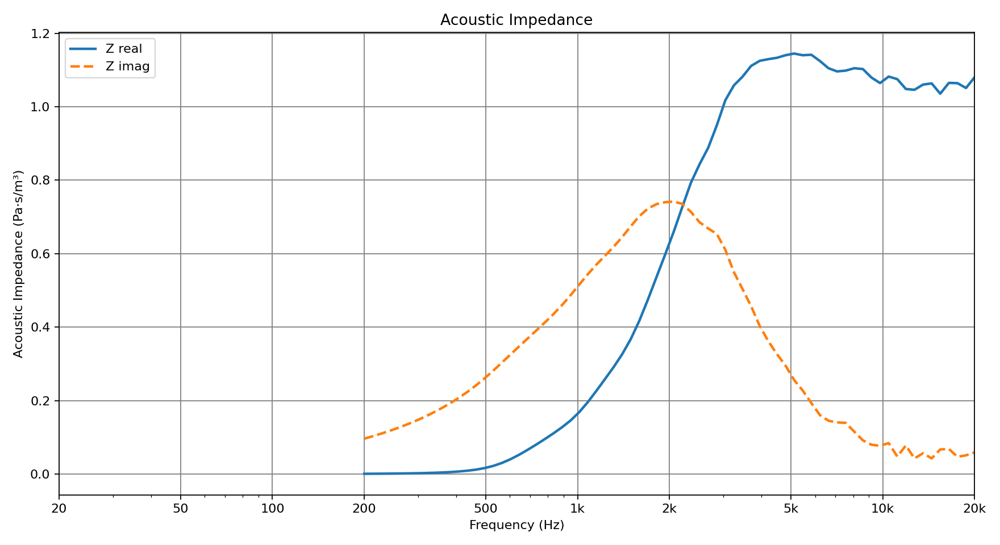

# BEMPPSolver

Utilities for running Boundary Element Method (BEM) simulations on loudspeaker surface meshes and generating directivity and impedance plots.

The project is organized as a simple four-step workflow:

1. `bemps clean`
2. `bemps solve`
3. `bemps prepare`
4. `bemps plot`

## What It Does

Given one or more loudspeaker surface meshes in Gmsh `.msh` format, this project can:

- clean and stitch a triangle surface mesh for BEM use
- run a frequency sweep with `bempp-cl`
- compute normalized horizontal and vertical polar response
- compute per-radiator acoustic impedance
- generate directivity and impedance plot images

More advanced simulations can also use TOML configuration files for multi-mesh solves and prescribed radiator drive shaping. See [docs/advanced-configuration.md](docs/advanced-configuration.md).

Ready-to-run example workflows are documented in [docs/examples.md](docs/examples.md).

## Requirements

This project is written in Python and depends on:

- `numpy`
- `meshio`
- `scipy`
- `matplotlib`
- `bempp-cl`
- `pyopencl`
- `gmsh`

Example install:

```bash
pip install numpy meshio scipy matplotlib bempp-cl pyopencl gmsh
```

To utilize OpenCL solving, you will need to download the Intel OpenCL runtime from this page: https://www.intel.com/content/www/us/en/developer/articles/technical/intel-cpu-runtime-for-opencl-applications-with-sycl-support.html, which is compatible with both AMD/Intel CPUs.

For local package development:

```bash
pip install -e .
```

## Mesh Expectations

The solver expects triangular surface meshes with physical groups in the `.msh` file.

- One or more surface groups may represent driven diaphragms or throat surfaces.
- All other surface groups are treated as rigid/unassigned surfaces.
- In [solver.py](src/bemppsolver/solver.py), the driven surface is selected with `tag_throat`, which defaults to `2`.

If your mesh uses different physical tag values, update the configuration in [solver.py](src/bemppsolver/solver.py) before running the solver.

## Workflow

### 1. Clean the mesh

Use `bemps clean` to merge coincident vertices, remove degenerate or duplicate triangles, and write a cleaned mesh.

Example files:

- input: `docs/examples/singleradiatorwaveguide/waveguide.msh`
- output: `docs/examples/singleradiatorwaveguide/waveguide_clean.msh`

```bash
bemps clean docs/examples/singleradiatorwaveguide/waveguide.msh docs/examples/singleradiatorwaveguide/waveguide_clean.msh --merge-tol 1e-9
```

If you run it without arguments, it uses the shared defaults in [defaults.py](src/bemppsolver/defaults.py).

### 2. Run the BEM simulation

Use `bemps solve` to run the acoustic simulation over a frequency sweep.

Default output:

- `pressure_data_raw.npz`

Important settings are still defined in `SimulationConfig` in [config.py](src/bemppsolver/config.py), including:

- frequency range and number of frequency points
- worker count for process-based parallel execution
- sound speed and density
- observation distance
- axial offset for polar origin
- `tag_throat`
- mesh scale factor

Run with defaults:

```bash
bemps solve
```

Run with CLI overrides:

```bash
bemps solve docs/examples/singleradiatorwaveguide/waveguide_clean.msh --output-npz docs/examples/singleradiatorwaveguide/pressure_data_raw.npz --freq-min 200 --freq-max 20000 --freq-count 72 --step-size 2.5 --min-angle -180 --max-angle 180 --axial-offset 0.116 --workers 4
```

For configured multi-source or multi-mesh cases:

```bash
bemps solve --config path/to/config.toml --output-npz pressure_data_configured.npz --freq-min 200 --freq-max 20000 --freq-count 72 --workers 4
```

The TOML configuration model is documented in [docs/advanced-configuration.md](docs/advanced-configuration.md).

The solver currently supports these CLI inputs:

- positional `mesh_file`
- `--output-npz`
- `--freq-min`
- `--freq-max`
- `--freq-count`
- `--step-size`
- `--min-angle`
- `--max-angle`
- `--axial-offset`
- `--workers`
- `--config`

`--workers` uses a spawn-based process pool and splits the frequency sweep into equally sized chunks. This is process-based rather than thread-based so it works consistently on Windows, macOS, and Linux.

### 3. Prepare visualization data

Use `bemps prepare` to convert raw solver output into plot-ready arrays.

Default input:

- `pressure_data_raw.npz`

Default output:

- `pressure_data_formatted.npz`

Run with defaults:

```bash
bemps prepare
```

This step also applies clipping, interpolation, and fractional-octave smoothing for the isobar plots.

Run with CLI overrides:

```bash
bemps prepare pressure_data_raw.npz pressure_data_formatted.npz --min-db -30 --max-db 0 --octave-smoothing 24 --hor-ref-angle 10 --vert-ref-angle 10
```

The prep stage currently supports these CLI inputs:

- `input_polar_npz`
- `output_npz`
- `--min-db`
- `--max-db`
- `--octave-smoothing`
- `--hor-ref-angle`
- `--vert-ref-angle`

### 4. Generate plots

Use `bemps plot` to generate PNG outputs.

Default input:

- `pressure_data_formatted.npz`

Default outputs:

- `horizontal_isobar.png`
- `vertical_isobar.png`
- `acoustic_impedance.png`

Sample output previews:




Run with defaults:

```bash
bemps plot
```

The visualizer supports these CLI inputs:

- positional `input_npz`
- `--output-dir`

## Typical Run Sequence

```bash
bemps clean
bemps solve
bemps prepare
bemps plot
```

## Examples

The repository includes two example cases under `docs/examples`:

- `singleradiatorwaveguide`: a single driven waveguide/radiator case
- `2waybookshelf`: a configured two-way loudspeaker with crossover-shaped radiator drives

See [docs/examples.md](docs/examples.md) for commands to regenerate the included outputs or run the full simulations from the meshes.

## Notes

- [mesh_clean.py](src/bemppsolver/mesh_clean.py) writes Gmsh 2.2 format for compatibility.
- [solver.py](src/bemppsolver/solver.py) is configured to use CPU devices by default via OpenCL.
- Advanced solver configuration is documented in [docs/advanced-configuration.md](docs/advanced-configuration.md).
